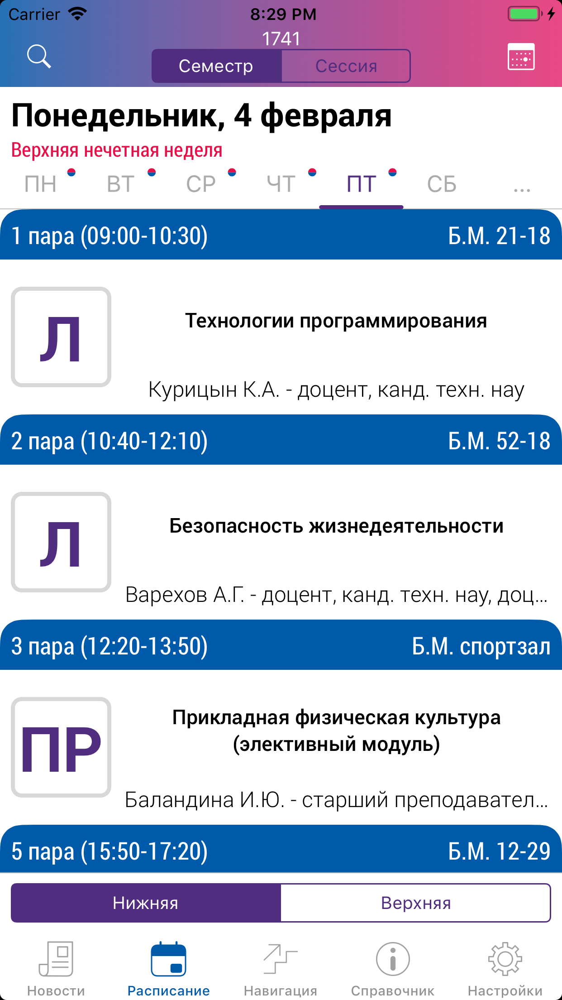
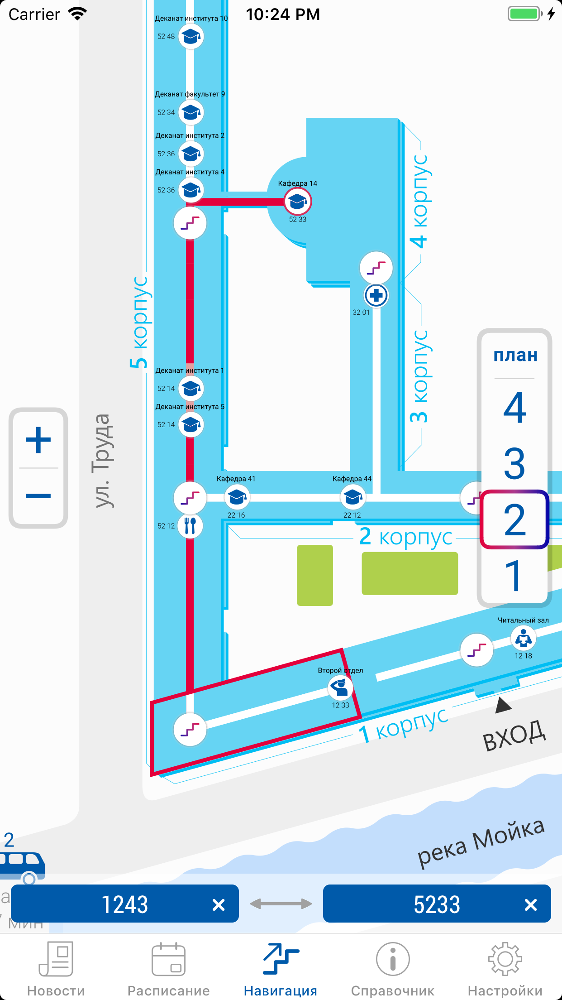
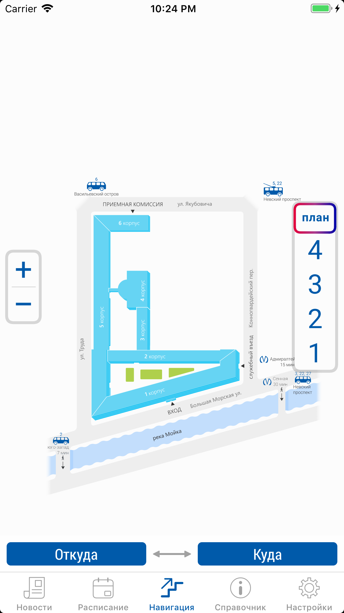
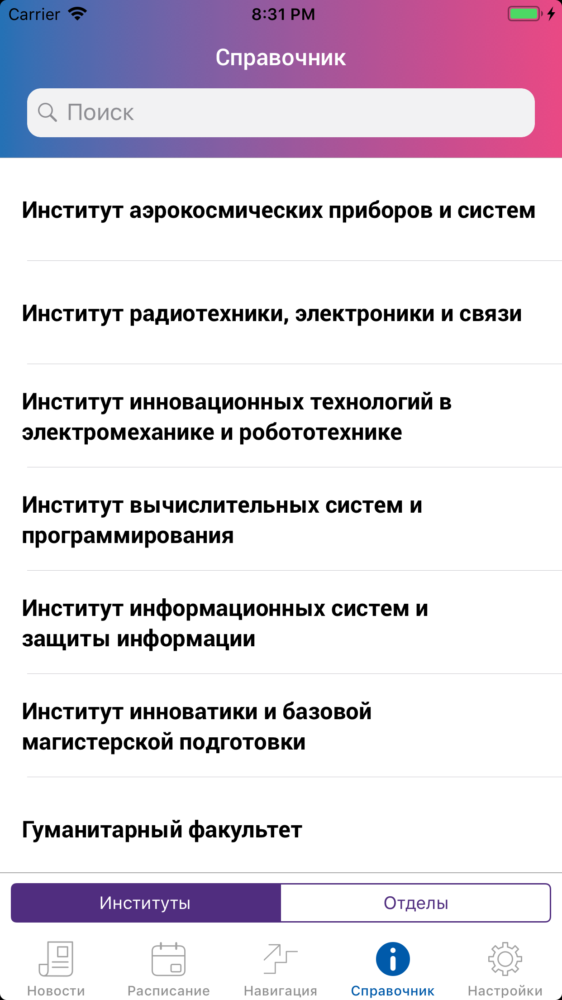
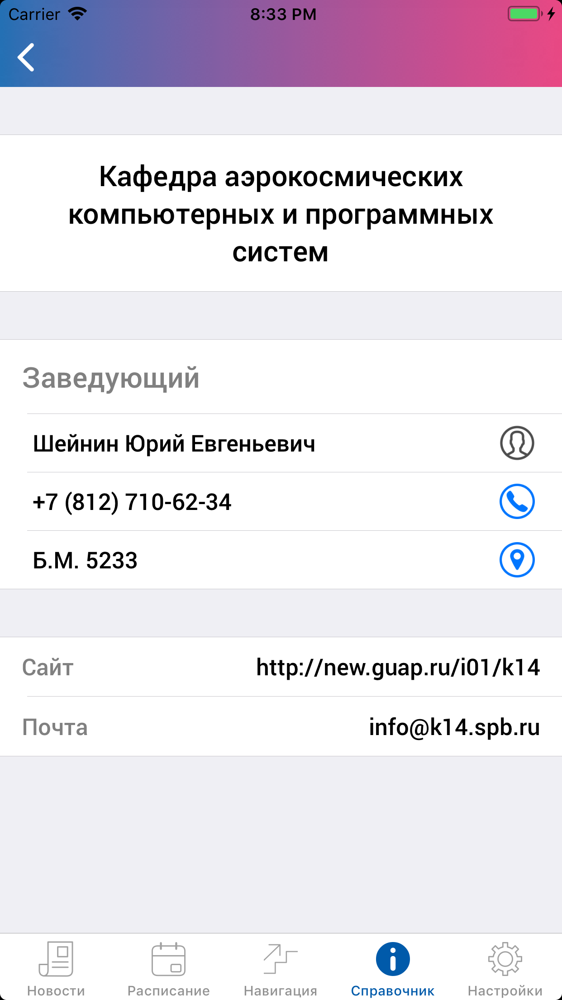
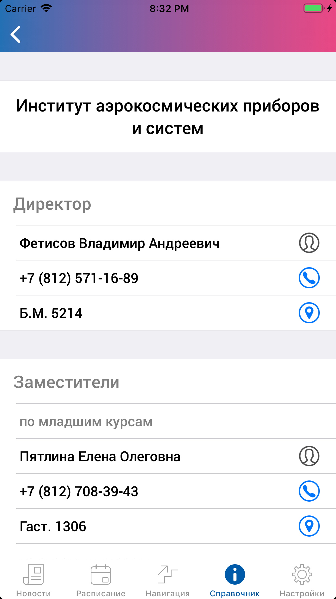

# Sputnik-iOS


Source code of [Спутник ГУАП](https://itunes.apple.com/ru/app/спутник-гуап/id1234040508?l=en&mt=8) app.
## About App
Official iOS app of [SUAI University](http://new.guap.ru) developed by [Sputnik SUAI](http://sputnik.guap.ru) team.
### News
University news are obtained from official [site](http://new.guap.ru/pubs). Only news of first page available.

 
### Schedule
Both [semester](rasp.guap.ru) and [session](raspsess.guap.ru) are available. It's possible to obtain schedule of groups, teachers or auditories. User can set base entity which will be available offline. Calendar also included.

 
### Navigation
Navigation module allows to find auditory make routes between auditories of main building of university placed on Bolshaya Morskaya str., 67. Sources of navigation html **is not included** (i.e. navigation will not work).

 
### Reference information
Reference information module contains information about institutes, departments. In sources real reference information replaced by **test** data.

  
## How to install
1. Download repo;
2. Using terminal go to root folder and install CocoaPods dependencies:
```bash
pod install
```
3. Open Sputnik.xcworkspace;
4. Delete Navigation folder placed in Sputnik/Resources;
5. cmd + R.
