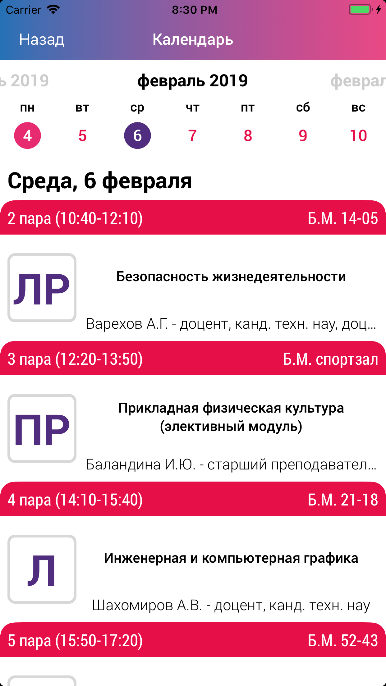

# Sputnik-iOS


Исходники приложения [Спутник ГУАП](https://itunes.apple.com/ru/app/спутник-гуап/id1234040508?l=en&mt=8)
## О приложении
Официальное iOS приложение университета [ГУАП](http://new.guap.ru), разработанное командой [Спутник ГУАП](http://sputnik.guap.ru).
### Новости
Новости университета, которые загружаются с официального [сайта](http://new.guap.ru/pubs). Доступны только те новости, которые находятся на первой странице.
 
### Расписание
Расписание загружается как [семестра](rasp.guap.ru), так и [сессии](raspsess.guap.ru). Доступен просмотр расписания группы, преподавателя или аудитории, доступен выбор одного расписания, которое хранится оффлайн. Имеется календарь.
 
### Навигация
Навигация позволяет прокладывать маршруты между аудиториями для главного корпуса, который находится по адресу ул. Большая Морская, д. 67. Исходники карт **не включены** (карты работать не будут).
 
### Справочник
Справочник содержит необходимую информацию о деканатах, отделах, институтах, кафедр и т. д. В исходниках справочник **тестовыми** данными.
  
## Установка
1. Скачайте репозиторий;
2. В терминале перейдите в корневую папку проекта и установите зависимости:
```bash
pod install
```
3. Откройте Sputnik.xcworkspace.
